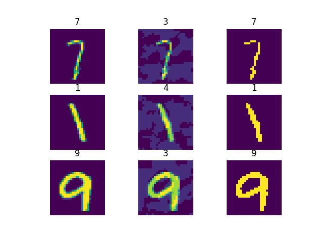
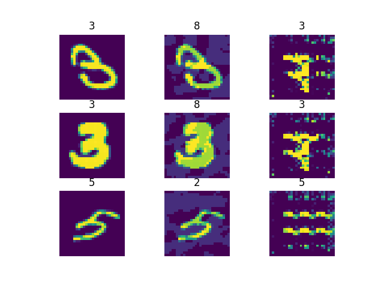

# AdvDefenseVAEs
This repository contains code for [Defense VAE](https://arxiv.org/abs/1812.06570) and [PuVAE](https://arxiv.org/abs/1903.00585).

**NOTE: Under Implementation**

## Usage
Install Adversarial Robustness 360 Toolbox (ART) v 1.3.0.

```
pip install git+https://github.com/kztakemoto/adversarial-robustness-toolbox
```

## Training
### Defense VEA
```
python train_defense_vae.py
```

### PuVAE
```
python train_puvae.py
```

## ToDo
- Fix the model architecture of PuVAE


## Comparison with earlier methods
Run preprocessors and postprocessors in ART.

```
python run_demo_earlier_methods.py
```

Tests using a CNN model for the MNIST dataset `models/mnistmodel.py`
- Accuracy on clean images (1000 test images): 98.90%
- Fooling rate of FGSM (`eps=0.13, norm=np.inf`): 52.30%

| Method | Fooling rate |
| ---- | ---- | 
| Feature Squeezing | 3.70% |
| Spatial Smoothing | 48.40% |
| Label Smoothing | 52.30% |
| Variance Minimization | 54.40% |
| Thermometer Encoding | 3.20% |
| Pixel Defend (`eps=32`) | 28.70% |
| Jpeg Compression | 46.90% |
| DefenseGAN | 37.20% |
| InverseGAN | 11.50% |


### Examples

Feature Squeezing



Inverse GAN



